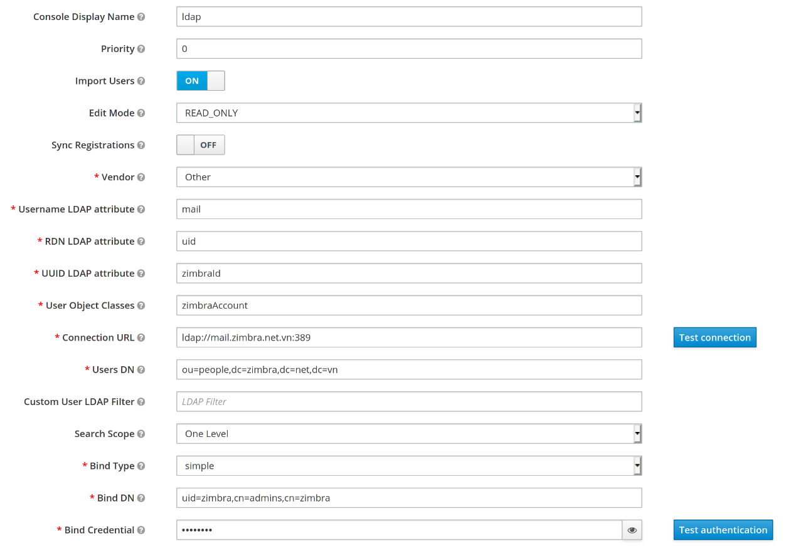

Single sign on with Keycloak
============================
[Keycloak](https://www.keycloak.org/documentation) is an open source Identity and Access Management solution aimed at modern applications and services.
It makes it easy to secure applications and services with little to no code. 

## Install Keycloak

### Requirement
* JDK version 1.8 or newer.

### Download and attract the latest stable version of Keycloak (current is 13.0.0)
```shell
cd /opt
wget https://github.com/keycloak/keycloak/releases/download/13.0.0/keycloak-13.0.0.tar.gz
tar -xvzf keycloak-13.0.0.tar.gz
```

### Deployment configuration
* Using a text editor to open **/opt/keycloak-13.0.0/standalone/configuration/standalone.xml** file.
* Config ssl: Fill `generate-self-signed-certificate-host` attribute of `<keystore>` tag with **your-keycloak-server-hostname** under `<server-identities>` tag
```xml
<ssl>
    <keystore path="application.keystore" relative-to="jboss.server.config.dir" keystore-password="password" alias="server" key-password="password" generate-self-signed-certificate-host="your-keycloak-server-hostname"/>
</ssl>
```
* Config tls: Fill `generate-self-signed-certificate-host` attribute of `<key-manager>` tag with **your-keycloak-server-hostname** under `<tls><key-managers>` tag
```xml
<key-manager name="applicationKM" key-store="applicationKS" generate-self-signed-certificate-host="your-keycloak-server-hostname">
    <credential-reference clear-text="password"/>
</key-manager>
```
*Config server hostname: Fill `alias` attribute of `host` tag under `<server name="default-server">` tag with **your-keycloak-server-hostname**
```xml
<host name="default-host" alias="your-keycloak-server-hostname">
    <location name="/" handler="welcome-content"/>
    <http-invoker security-realm="ApplicationRealm"/>
</host>
```
* Config binding interfaces: Edit `value` attribute of `<inet-address> tag` under `<interfaces>` tag with **your-keycloak-server-ip-address**
```xml
<interfaces>
    <interface name="management">
        <inet-address value="${jboss.bind.address.management:your-keycloak-server-ip-address}"/>
        <!--inet-address value="${jboss.bind.address.management:127.0.0.1}"/-->
    </interface>
    <interface name="public">
        <inet-address value="${jboss.bind.address:your-keycloak-server-ip-address}"/>
    </interface>
</interfaces>
```
* Config socket binding ports: Edit `port` attribute of `socket-binding` tag under `socket-binding-group` tag. Ex:
```xml
<socket-binding name="http" port="${jboss.http.port:9080}"/>
<socket-binding name="https" port="${jboss.https.port:9443}"/>
```

### Add Server Admin User
```shell
cd /opt/keycloak-13.0.0/
./bin/add-user.sh
```

### Add Keycloak Admin User
```shell
cd /opt/keycloak-13.0.0/
./bin/add-user-keycloak.sh -u your-admin-user -p your-admin-password
```

### Running the Keycloak server
```shell
cd /opt/keycloak-13.0.0/
LAUNCH_JBOSS_IN_BACKGROUND=1
./bin/standalone.sh
# Running the Keycloak server on background
# ./bin/standalone.sh &
```

### Config Keycloak User Federation with Zimbra LDAP
* Sign in to Keycloak Administration Console as an admin by visiting url `https://your-keycloak-server-hostname:9443/auth/admin` from your web browser.
* On the Main menu, click **Configure > User Federation**
* Click **Add Provider... -> ldap**. Fill in **Add user federation provider** form like that

* Click **Test authenticaion** button to check ldap configuration
* Click **Save** button to add ldap user federation
* Click **Synchronize all users** button to synchronize zimbra users to Keycloak users
* On the Main menu, click **Manage > Users** to list users from ldap

### Config Keycloak ssl certificate & hostname with Zimbra
* Export untrusted ssl certificate to the file:
~~~shell
openssl s_client -servername your-keycloak-server-hostname -connect your-keycloak-server-hostname:9443 </dev/null | sed -ne '/-BEGIN CERTIFICATE-/,/-END CERTIFICATE-/p' >/path/to/keycloak.pem
~~~
* Execute following commands under the `zimbra` user:
~~~shell
zmcertmgr addcacert /path/to/keycloak.pem
zmprov -l mcf +zimbraCsrfAllowedRefererHosts your-keycloak-server-hostname
zmmailboxdctl restart
~~~

### Single sign on with SAML protocol
#### Config Zimbra SSO
* Using a text editor to open **/opt/zimbra/conf/zm.sso.properties** file.
* Set **sso.defaultClient** to `SAML2Client`
* Set **sso.callbackUrl** to `https://your-zimbra-hostname/service/extension/sso/callback`
* Set **saml.callbackUrl** to `https://your-zimbra-hostname/service/extension/saml/callback`
* Set **sso.postLogoutURL** to `https://your-zimbra-hostname/`
* Set **saml.identityProviderMetadataPath** to `https://your-keycloak-server-hostname:9443/auth/realms/name-of-your-realm/protocol/saml/descriptor`
* Restart mailbox under `zimbra` user: `zmmailboxdctl restart`

#### Create SAML client for Zimbra on Keycloak
* Download SAML service provider metadata at `https://your-zimbra-hostname/service/extension/saml/metadata` to `metadata.xml`.
* Sign in to Keycloak Administration Console as an admin by visiting url `https://your-keycloak-server-hostname:9443/auth/admin` from your web browser.
* On the Main menu, click **Configure > Clients**
* Click **Create** button, click **Select file** to upload service provider metadata file (`metadata.xml`).
  Click **Save** to create new SAML client.
* Select **Name ID Format** with `email`, Click **Save**.
* Click **Mappers** tab. Click **Add Builtin** button, select all `builtin`, click **Add selected** button.

#### Testing
* Testing service provider metadata by visiting url `https://your-zimbra-hostname/service/extension/saml/metadata` from your web browser.
* Testing single sign on by visiting url `https://your-zimbra-hostname/service/extension/saml/login` from your web browser.
* Testing logout & single logout (SLO) by visiting url `https://your-zimbra-hostname/service/extension/sso/logout` from your web browser.

#### Replace login and logout urls
* Execute following commands with the `zimbra` user:
```shell
zmprov mcf zimbraWebClientLoginURL https://your-zimbra-hostname/service/extension/saml/login
zmprov mcf zimbraWebClientLogoutURL https://your-zimbra-hostname/service/extension/sso/logout
zmmailboxdctl restart
```

### Single sign on with OpenID Connect protocol
#### Create OpenID Connect client for Zimbra on Keycloak
* Sign in to Keycloak Administration Console as an admin by visiting url `https://your-keycloak-server-hostname:9443/auth/admin` from your web browser.
* On the Main menu, click **Configure > Clients**
* Click **Create** button, fill **Client ID** with `your-client-id`.
* Select **Access Type** with **confidential**, fill **Valid Redirect URIs** with `https://your-zimbra-hostname/*`,
  fill **Backchannel Logout URL** with `https://your-zimbra-hostname/service/extension/oidc/callback?client_name=OidcClient&logoutendpoint=true`,
  choose **Backchannel Logout Session Required** with `On`.
  Click **Save** button to update settings.
* Click **Credentials** tab. Select **Access Type** with **Client Authenticator**, click **Regenerate Secret** button to regenerate client secret

#### Config Zimbra SSO
* Using a text editor to open **/opt/zimbra/conf/zm.sso.properties** file.
* Set **sso.defaultClient** to `OidcClient`
* Set **sso.callbackUrl** to `https://your-zimbra-hostname/service/extension/sso/callback`
* Set **oidc.callbackUrl** to `https://your-zimbra-hostname/service/extension/oidc/callback`
* Set **sso.postLogoutURL** to `https://your-zimbra-hostname/`
* Set **oidc.discoveryUri** to `https://your-keycloak-server-hostname:9443/auth/realms/name-of-your-realm/.well-known/openid-configuration`
* Set **oidc.id** to `Client ID`
* Set **oidc.secret** to `Client Secret`
* Restart mailbox under `zimbra` user: `zmmailboxdctl restart`

**Notes**: You can get `Client Secret` from **Credentials** tab on OpenID Connect client that you configured

#### Testing
* Testing single sign on by visiting url `https://your-zimbra-hostname/service/extension/oidc/login` from your web browser.
* Testing logout & single logout (SLO) by visiting url `https://your-zimbra-hostname/service/extension/sso/logout` from your web browser.

#### Replace login and logout urls
* Execute following commands with the `zimbra` user:
```shell
zmprov mcf zimbraWebClientLoginURL https://your-zimbra-hostname/service/extension/oidc/login
zmprov mcf zimbraWebClientLogoutURL https://your-zimbra-hostname/service/extension/sso/logout
zmmailboxdctl restart
```
