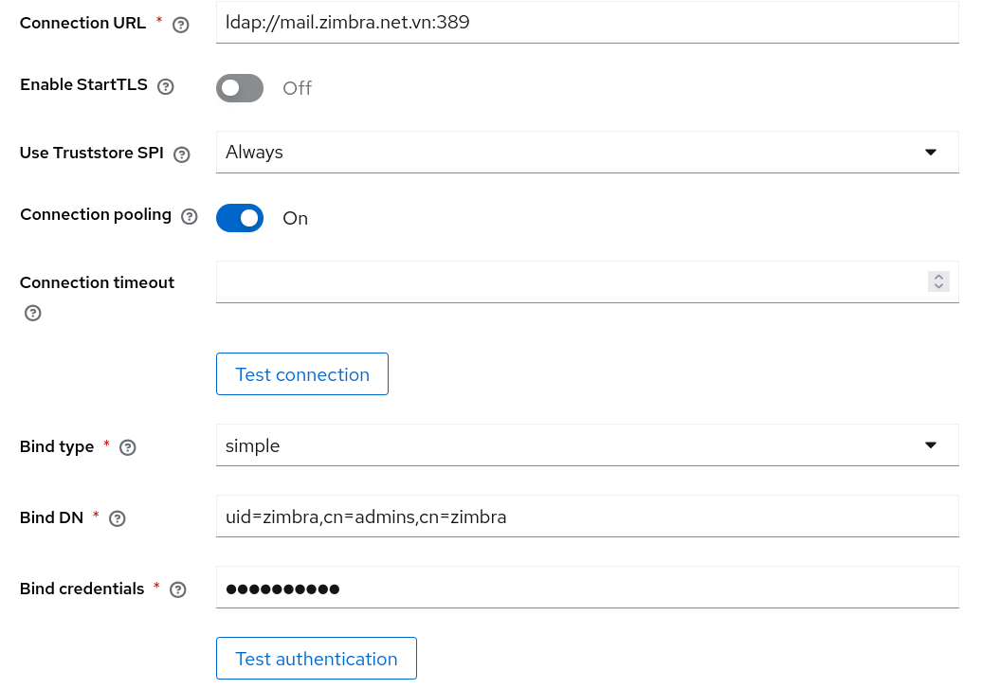
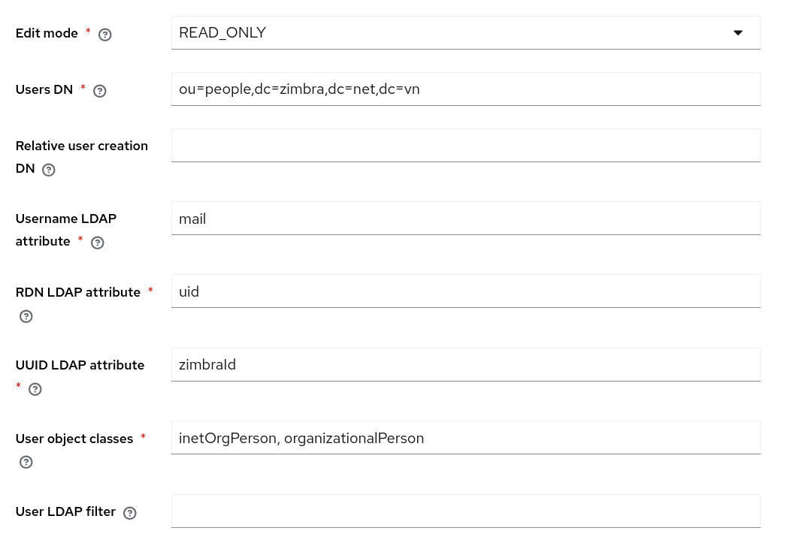
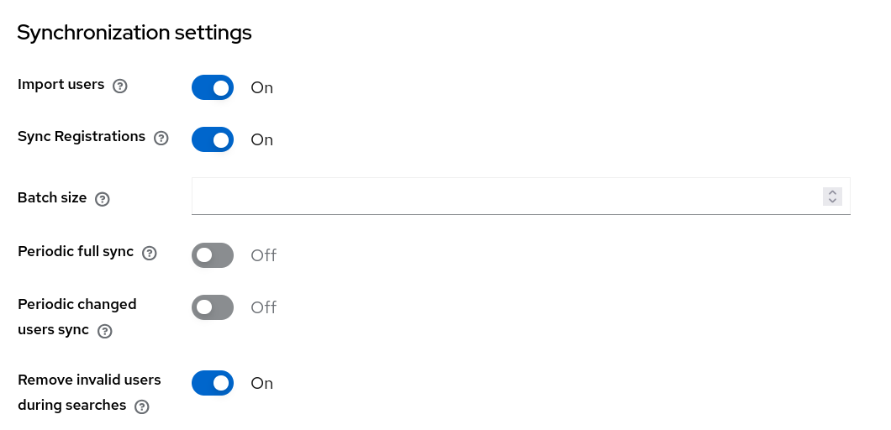
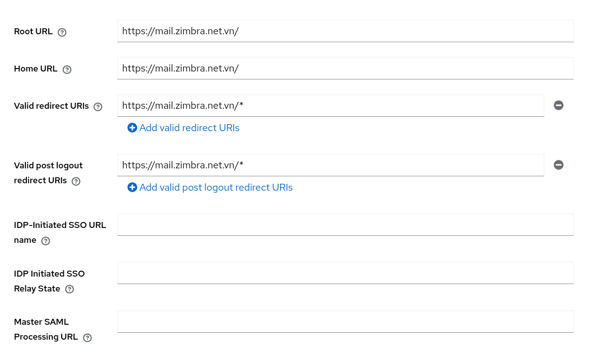
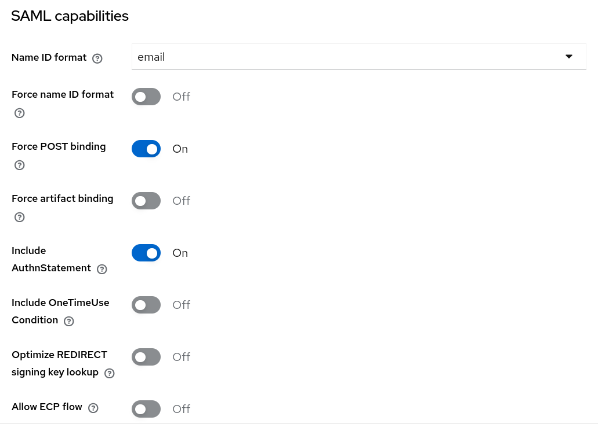
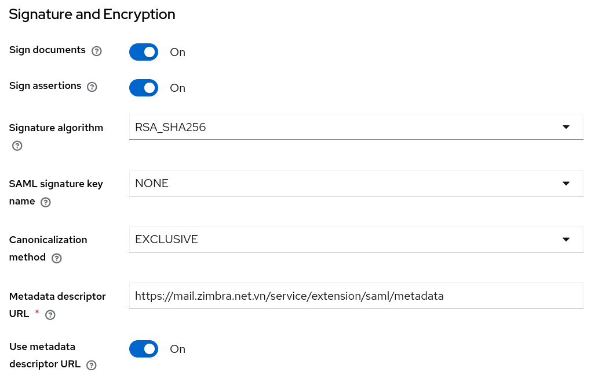
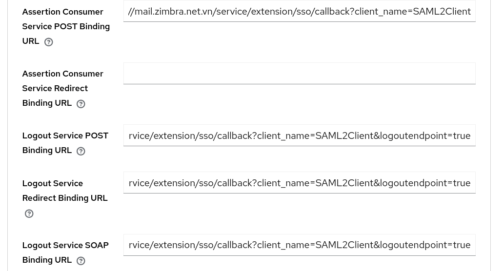
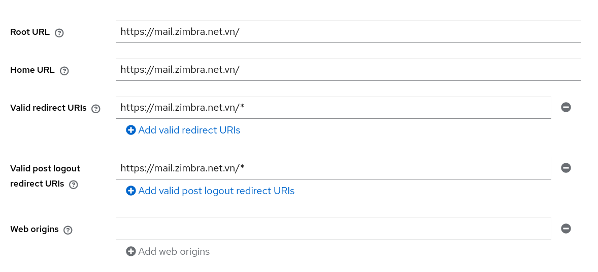

Single sign on with Keycloak
============================
[Keycloak](https://www.keycloak.org/documentation) is an open source Identity and Access Management solution aimed at modern applications and services.
It makes it easy to secure applications and services with little to no code. 

## Install Keycloak

### Requirement
* JDK version 25 or newer.

### Download and attract the latest stable version of Keycloak (current is 26.0.0)
```shell
cd /opt
wget https://github.com/keycloak/keycloak/releases/download/26.0.0/keycloak-26.0.0.tar.gz
tar -xvzf keycloak-26.0.0.tar.gz
```

### Running the Keycloak server in development mode
```shell
cd /opt/keycloak-26.0.0/
./bin/kc.sh start-dev --http-host=your-keycloak-hostname --http-port=8080
```

### Create an admin user
Keycloak has no default admin user. You need to create an admin user before you can start Keycloak.
* Open `http://your-keycloak-hostname:8080`.
* Fill in the form with your preferred username and password.

### Config Keycloak User Federation with Zimbra LDAP
* Sign in to Keycloak Administration Console as an admin by visiting url `http://your-keycloak-hostname:8080/admin` from your web browser.
* On the Main menu, click **Configure > User Federation**
* Click **Add Provider... -> ldap**.
* Fill in **Connection and authentication settings** form like that

* Click **Test authenticaion** button to check ldap configuration
* Fill in **LDAP searching and updating** form like that

* Fill in **Synchronization settings** form like that

* Click **Save** button to add ldap user federation
* Click **Sync all users** button to synchronize zimbra users to Keycloak users
* On the Main menu, click **Manage > Users** to list users from ldap

### Config untrusted ssl of Keycloak & Zimbra
* Export untrusted ssl certificate to the file:
```shell
openssl s_client -servername your-keycloak-hostname -connect your-keycloak-hostname:443 </dev/null | sed -ne '/-BEGIN CERTIFICATE-/,/-END CERTIFICATE-/p' >/path/to/keycloak.pem
openssl s_client -servername your-zimbra-hostname -connect your-zimbra-hostname:443 </dev/null | sed -ne '/-BEGIN CERTIFICATE-/,/-END CERTIFICATE-/p' >/path/to/zimbra.pem
```
* In Zimbra server, execute following commands under the `zimbra` user:
```shell
zmcertmgr addcacert /path/to/keycloak.pem
zmprov -l mcf +zimbraCsrfAllowedRefererHosts your-keycloak-hostname
zmmailboxdctl restart
```
* In Zimbra server, copy `zimbra.pem` to `/opt/keycloak-26.0.0/conf/truststores`

### Single sign on with SAML protocol
#### Config Zimbra SSO
* Using a text editor to open **/opt/zimbra/conf/zm.sso.properties** file.
* Set **sso.defaultClient** to `SAML2Client`
* Set **sso.callbackUrl** to `https://your-zimbra-hostname/service/extension/sso/callback`
* Set **saml.callbackUrl** to `https://your-zimbra-hostname/service/extension/saml/callback`
* Set **sso.postLogoutURL** to `https://your-zimbra-hostname/`
* Set **saml.identityProviderMetadataPath** to `http://your-keycloak-hostname:8080/realms/name-of-your-realm/protocol/saml/descriptor`
* Restart mailbox under `zimbra` user: `zmmailboxdctl restart`

#### Create SAML client for Zimbra on Keycloak
* Copy `entityID` of service provider metadata at `https://your-zimbra-hostname/service/extension/saml/metadata`.
* Sign in to Keycloak Administration Console as an admin by visiting url `http://your-keycloak-hostname:8080/admin` from your web browser.
* On the Main menu, click **Configure > Clients**
* Click **Create client** button, choose **SAML** Client type and fill `entityID` to **Client ID**, click **Next**.
* Fill in **Login settings** form like that

* Click **Save** to create new SAML client.
* Fill in **SAML capabilities** form like that

* Fill in **Signature and Encryption** form like that

* Click **Save**.
* Click **Advanced** tab.
* Fill URLs from metadata to **Fine Grain SAML Endpoint Configuration** form like that

* Click **Save**.

#### Testing
* Testing service provider metadata by visiting url `https://your-zimbra-hostname/service/extension/saml/metadata` from your web browser.
* Testing single sign on by visiting url `https://your-zimbra-hostname/service/extension/saml/login` from your web browser.
* Testing logout & single logout by visiting url `https://your-zimbra-hostname/service/extension/sso/logout` from your web browser.

#### Replace login and logout urls
* Execute following commands with the `zimbra` user:
```shell
zmprov mcf zimbraWebClientLoginURL https://your-zimbra-hostname/service/extension/saml/login
zmprov mcf zimbraWebClientLogoutURL https://your-zimbra-hostname/service/extension/sso/logout
zmmailboxdctl restart
```

### Single sign on with OpenID Connect protocol
#### Create OpenID Connect client for Zimbra on Keycloak
* Sign in to Keycloak Administration Console as an admin by visiting url `http://your-keycloak-hostname:8080/admin` from your web browser.
* On the Main menu, click **Configure > Clients**
* Click **Create client** button, choose **OpenID Connect** Client type and fill **Client ID** with `your-client-id`, click **Next**.
* Enable **Client authentication**. click **Next**.
* Fill in **Login settings** form like that

* Click **Save** to create new OpenID client.
* On **Logout settings**, fill **Front-channel Logout URL** with
  `https://your-zimbra-hostname/service/extension/oidc/callback?client_name=OidcClient&logoutendpoint=true`,
  choose **Front-channel logout session required** with `On`.
  Click **Save** button to update settings.
* Click **Credentials** tab. click **Regenerate** button to regenerate client secret

#### Config Zimbra SSO
* Using a text editor to open **/opt/zimbra/conf/zm.sso.properties** file.
* Set **sso.defaultClient** to `OidcClient`
* Set **sso.callbackUrl** to `https://your-zimbra-hostname/service/extension/sso/callback`
* Set **oidc.callbackUrl** to `https://your-zimbra-hostname/service/extension/oidc/callback`
* Set **sso.postLogoutURL** to `https://your-zimbra-hostname/`
* Set **oidc.discoveryUri** to `http://your-keycloak-hostname:8080/realms/name-of-your-realm/.well-known/openid-configuration`
* Set **oidc.id** to `Client ID`
* Set **oidc.secret** to `Client Secret`
* Restart mailbox under `zimbra` user: `zmmailboxdctl restart`

**Notes**: You can get `Client Secret` from **Credentials** tab on OpenID Connect client that you configured

#### Testing
* Testing single sign on by visiting url `https://your-zimbra-hostname/service/extension/oidc/login` from your web browser.
* Testing logout & single logout (SLO) by visiting url `https://your-zimbra-hostname/service/extension/sso/logout` from your web browser.

#### Replace login and logout urls
* Execute following commands with the `zimbra` user:
```shell
zmprov mcf zimbraWebClientLoginURL https://your-zimbra-hostname/service/extension/oidc/login
zmprov mcf zimbraWebClientLogoutURL https://your-zimbra-hostname/service/extension/sso/logout
zmmailboxdctl restart
```
