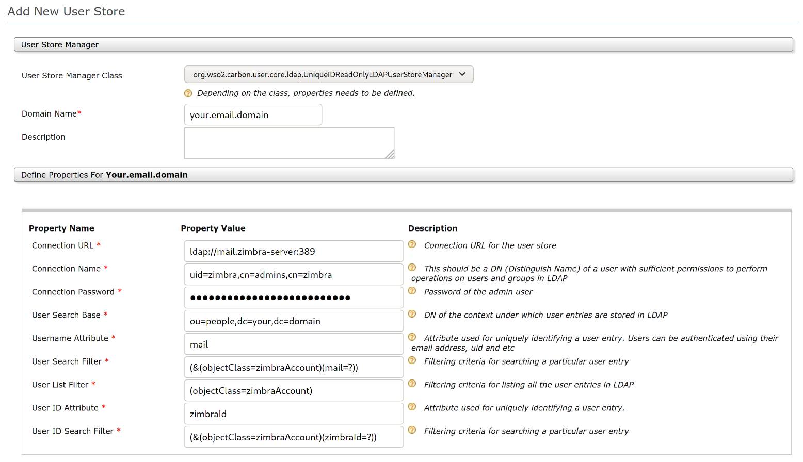

Single sign on with WSO2 Identity Server (WSO2 IS)
==================================================
[WSO2 IS](https://is.docs.wso2.com) is an API-driven open source IAM product designed to help you build effective CIAM solutions.
It is based on open standards such as SAML, OAuth and OIDC with the deployment options of on-premise, cloud, and hybrid.
It supports complex IAM requirements given its high extensibility.

## Install WSO2 IS

### Requirement
* JDK version 1.8 or newer.

### Download and unzip the latest stable version of WSO2 IS (current is 5.11.0)
```shell
cd /opt
wget https://github.com/wso2/product-is/releases/download/v5.11.0/wso2is-5.11.0.zip
unzip wso2is-5.11.0.zip
```

### Deployment configuration
* Using a text editor to open **/opt/wso2is-5.11.0/repository/conf/deployment.toml** file.
* Edit `hostname` and `node_ip` under `[server]` section
```toml
[server]
hostname = "your id server hostname"
node_ip = "your id server ip address"
```
* Edit `username` and `password` under `[super_admin]` section
```toml
[super_admin]
username = "your admin user"
password = "your admin password"
```
* Add following content like that.
```toml
[cors]
allow_generic_http_requests = true
allow_any_origin = false
allowed_origins = [
    "https://your-zimbra-hostname"
]
allow_subdomains = false
supported_methods = [
    "GET",
    "POST",
    "HEAD",
    "OPTIONS"
]
support_any_header = true
supported_headers = []
exposed_headers = []
supports_credentials = true
max_age = 3600
tag_requests = false
```

### Running the Identity Server
```shell
cd /opt/wso2is-5.11.0/
./bin/wso2server.sh start
```

### Config IS user store with Zimbra LDAP
* Sign in to WSO2 Identity Server Management Console as an admin by visiting url `https://your-id-server-hostname:9443` from your web browser.
* On the Main menu, click **Identity > User Stores > Add**. Fill in **Add New User Store** form like that

* Click **Add** button to add ldap user store
* On the Main menu, click **Identity > Users and Roles > List**
* Click **Users** to list users from ldap

### Add Service Provider for Zimbra Mail Server
* Sign in to WSO2 Identity Server Management Console as an admin by visiting url `https://your-id-server-hostname:9443` from your web browser.
* On the Main menu, click **Identity > Service Providers > Add**
* Enter **Service Provider Name** and click **Register** to add service provider

### Config WSO2 IS ssl certificate & hostname with Zimbra
* Export untrusted ssl certificate to the file:
~~~shell
openssl s_client -servername your-id-server-hostname -connect your-id-server-hostname:9443 </dev/null | sed -ne '/-BEGIN CERTIFICATE-/,/-END CERTIFICATE-/p' >/path/to/wso2-is.pem
~~~
* Execute following commands under the `zimbra` user:
~~~shell
zmcertmgr addcacert /path/to/wso2-is.pem
zmprov -l mcf +zimbraCsrfAllowedRefererHosts your-id-server-hostname
zmmailboxdctl restart
~~~

### Single sign on with SAML protocol
#### Config Zimbra SSO
* Using a text editor to open **/opt/zimbra/conf/zm.sso.properties** file.
* Set **sso.defaultClient** to `SAML2Client`
* Set **sso.callbackUrl** to `https://your-zimbra-hostname/service/extension/sso/callback`
* Set **saml.callbackUrl** to `https://your-zimbra-hostname/service/extension/saml/callback`
* Set **sso.postLogoutURL** to `https://your-zimbra-hostname/`
* Set **saml.identityProviderMetadataPath** to `https://your-id-server-hostname:9443/identity/metadata/saml2`
* Restart mailbox under `zimbra` user: `zmmailboxdctl restart`

#### Config SAML service provider
* Download SAML service provider metadata at `https://your-zimbra-hostname/service/extension/saml/metadata` to `metadata.xml`.
* Sign in to WSO2 Identity Server Management Console as an admin by visiting url `https://your-id-server-hostname:9443` from your web browser.
* On the Main menu, click **Identity > Service Providers > List**
* Click on **Edit** link that corresponds to the service provider for Zimbra Mail Server
* On **Inbound Authentication Configuration -> SAML2 Web SSO Configuration**, click **Configure**
* Choose **Metadata File Configuration**, upload service provider metadata file (`metadata.xml`).
  Click **Upload** to register new SAML srvice provider
* On **Inbound Authentication Configuration -> SAML2 Web SSO Configuration**, click **Edit**
* Fill **NameID format** with `urn:oasis:names:tc:SAML:1.1:nameid-format:emailAddress`
* Check **Enable Response Signing** and **Enable Single Logout**
* Fill **SLO Response URL** and **SLO Request URL** with `https://your-zimbra-hostname/service/extension/saml/callback?client_name=SAML2Client&logoutendpoint=true`
* Check **Enable Attribute Profile** and **Include Attributes in the Response Always**
* Click **Update** to update SAML service provider configuration

#### Testing
* Testing service provider metadata by visiting url `https://your-zimbra-hostname/service/extension/saml/metadata` from your web browser.
* Testing single sign on by visiting url `https://your-zimbra-hostname/service/extension/saml/login` from your web browser.
* Testing logout & single logout (SLO) by visiting url `https://your-zimbra-hostname/service/extension/sso/logout` from your web browser.

#### Replace login and logout urls
* Execute following commands with the `zimbra` user:
```shell
zmprov mcf zimbraWebClientLoginURL https://your-zimbra-hostname/service/extension/saml/login
zmprov mcf zimbraWebClientLogoutURL https://your-zimbra-hostname/service/extension/sso/logout
zmmailboxdctl restart
```

### Single sign on with OpenID Connect protocol
#### Config OpenID Connect service provider
* Sign in to WSO2 Identity Server Management Console as an admin by visiting url `https://your-id-server-hostname:9443` from your web browser.
* On the Main menu, click **Identity > Service Providers > List**
* Click on **Edit** link that corresponds to the service provider for Zimbra Mail Server
* On **Inbound Authentication Configuration -> OAuth/OpenID Connect Configuration**, click **Configure**
* Fill **Callback Url** with `regexp=https://your-zimbra-hostname(.*)`
* Check **Enable OIDC Backchannel Logout** and fill **Backchannel Logout Url** with `https://your-zimbra-hostname/service/extension/oidc/callback?client_name=OidcClient&logoutendpoint=true`

#### Config Zimbra SSO
* Using a text editor to open **/opt/zimbra/conf/zm.sso.properties** file.
* Set **sso.defaultClient** to `OidcClient`
* Set **sso.callbackUrl** to `https://your-zimbra-hostname/service/extension/sso/callback`
* Set **oidc.callbackUrl** to `https://your-zimbra-hostname/service/extension/oidc/callback`
* Set **sso.postLogoutURL** to `https://your-zimbra-hostname/`
* Set **oidc.discoveryUri** to `https://your-id-server-hostname:9443/oauth2/oidcdiscovery/.well-known/openid-configuration`
* Set **oidc.id** to `OAuth Client Key`
* Set **oidc.secret** to `OAuth Client Secret`
* Restart mailbox under `zimbra` user: `zmmailboxdctl restart`

**Notes**: You can get `OAuth Client Key` and `OAuth Client Secret` from **Inbound Authentication Configuration -> OAuth/OpenID Connect Configuration** on OpenID Connect service provider that you configured

#### Testing
* Testing single sign on by visiting url `https://your-zimbra-hostname/service/extension/oidc/login` from your web browser.
* Testing logout & single logout (SLO) by visiting url `https://your-zimbra-hostname/service/extension/sso/logout` from your web browser.

#### Replace login and logout urls
* Execute following commands with the `zimbra` user:
```shell
zmprov mcf zimbraWebClientLoginURL https://your-zimbra-hostname/service/extension/oidc/login
zmprov mcf zimbraWebClientLogoutURL https://your-zimbra-hostname/service/extension/sso/logout
zmmailboxdctl restart
```
